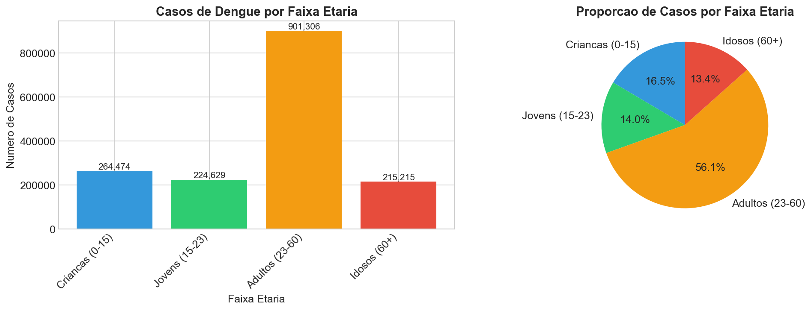
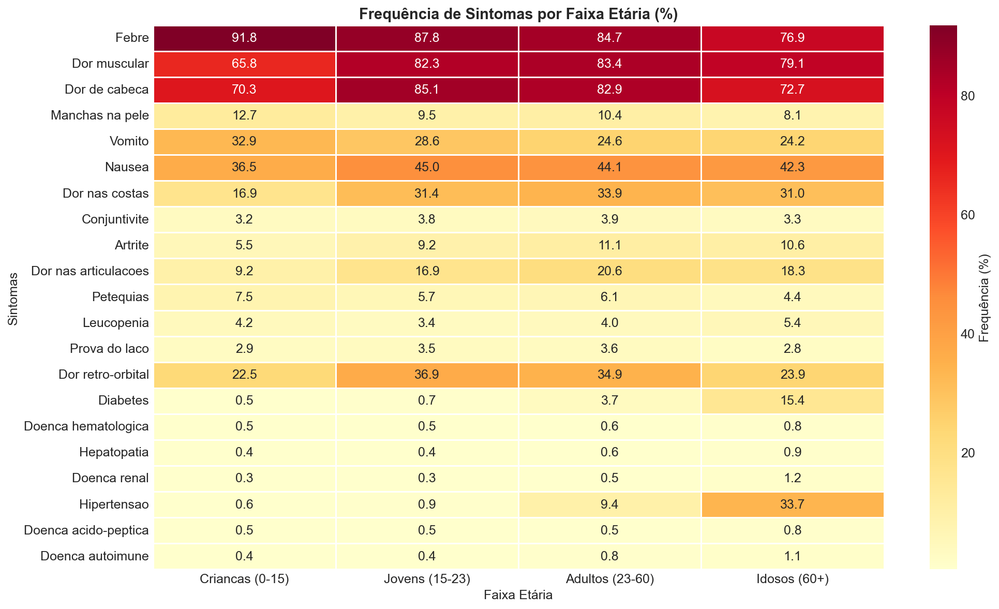
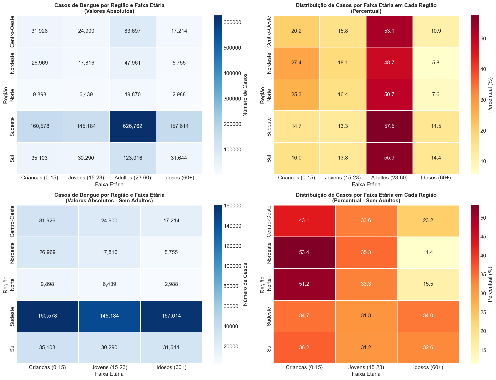
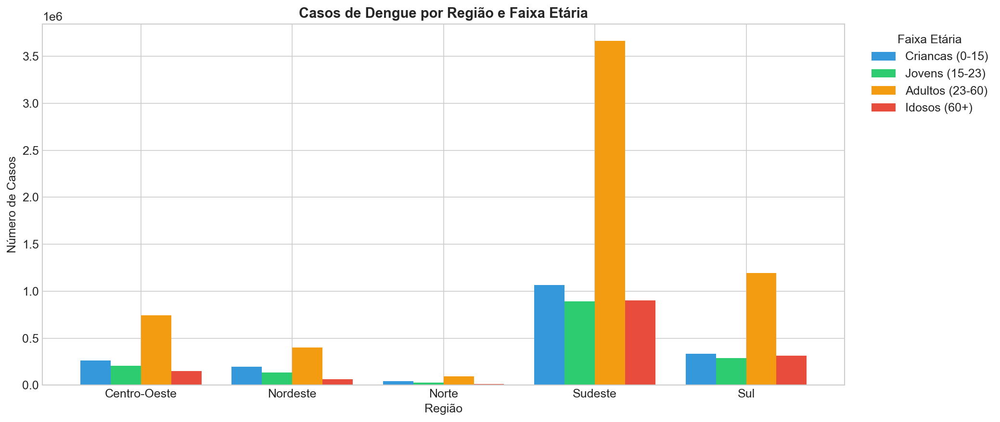
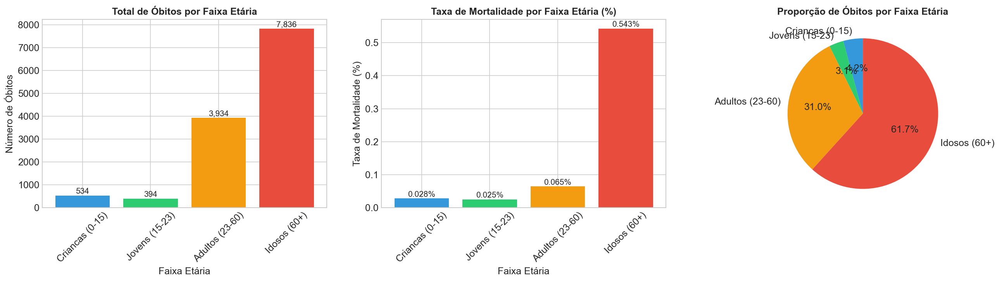
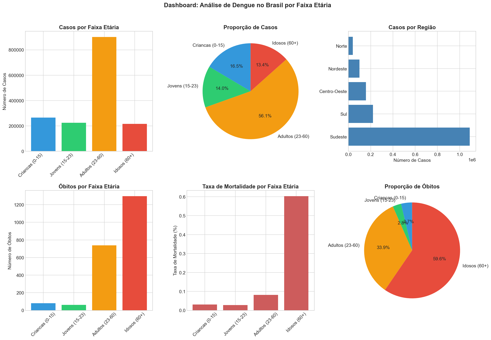
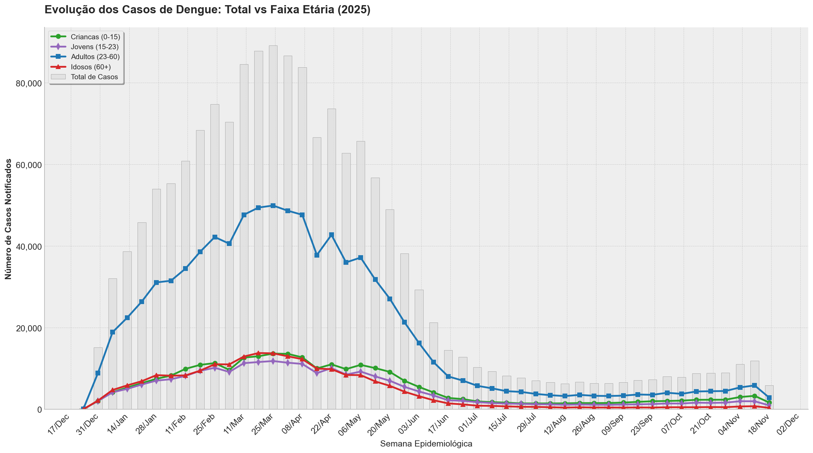

# 📊 Relatório de Análise - Dengue no Brasil (2025)

## Resumo Executivo

Este relatório apresenta os **resultados completos** da análise exploratória de dados de casos de dengue notificados no Brasil em 2025, incluindo insights, observações e propostas de estudos futuros.

**Base de dados**: Sistema de Informação de Agravos de Notificação (SINAN) - Ministério da Saúde.

---

## Fontes de Dados

### 1. Dados Epidemiológicos
- **Dataset**: `DENGBR25.csv` (Microdados de notificação de Dengue - 2025)
- **Origem**: DATASUS / SINAN Online
- **Descrição**: Base de dados contendo registros individualizados de notificações, incluindo dados demográficos (idade, sexo), clínicos (sintomas, evolução) e geográficos (município de notificação)
- **URL**: [http://sinan.saude.gov.br/](http://sinan.saude.gov.br/)

### 2. Dados Territoriais e Administrativos
- **Fonte**: Instituto Brasileiro de Geografia e Estatística (IBGE)
- **Dataset**: Divisão Territorial Brasileira (DTB) - 2024
- **Arquivos**: `RELATORIO_DTB_BRASIL_2024_MUNICIPIOS.xls`, `RELATORIO_DTB_BRASIL_2024_DISTRITOS.xls`
- **URL**: [IBGE - Divisão Territorial Brasileira](https://www.ibge.gov.br/geociencias/organizacao-do-territorio/estrutura-territorial/23701-divisao-territorial-brasileira.html)

### 3. Dados Geoespaciais (Shapefiles)
- **Fonte**: Repositório Open Source / IBGE
- **Recurso**: Malhas Digitais Municipais e Estaduais
- **URL**: [IBGE - Malhas Territoriais](https://www.ibge.gov.br/geociencias/organizacao-do-territorio/malhas-territoriais.html)

---

## 1. Visão Geral do Dataset

| Métrica | Valor |
|---------|-------|
| **Total de registros** | 1.502.259 casos |
| **Período** | 2025 |
| **Estados cobertos** | 27 UFs |
| **Municípios identificados** | 5.571 |

---

## 2. Distribuição por Faixa Etária

### 2.1 Número de Casos por Faixa Etária

| Faixa Etária | Casos | Percentual |
|--------------|-------|------------|
| **Adultos (23-60 anos)** | 847.303 | 56,4% |
| **Crianças (0-15 anos)** | 239.891 | 16,0% |
| **Idosos (60+ anos)** | 208.872 | 13,9% |
| **Jovens (15-23 anos)** | 206.193 | 13,7% |

### 2.2 Análise

- A faixa etária de **adultos (23-60 anos)** concentra mais da metade dos casos (56,4%)
- **Crianças** representam a segunda maior faixa com 16% dos casos
- **Idosos** e **Jovens** têm proporções similares (cerca de 14% cada)

---

## 3. Análise de Sintomas por Faixa Etária

### 3.1 Sintomas Mais Comuns (Top 5)

#### Crianças (0-15 anos)
| Sintoma | Frequência |
|---------|------------|
| Febre | 92,3% |
| Dor de cabeça | 69,8% |
| Dor muscular | 65,3% |
| Náusea | 37,7% |
| Vômito | 34,2% |

#### Jovens (15-23 anos)
| Sintoma | Frequência |
|---------|------------|
| Febre | 87,4% |
| Dor de cabeça | 85,6% |
| Dor muscular | 82,9% |
| Náusea | 47,0% |
| Dor retro-orbital | 35,9% |

#### Adultos (23-60 anos)
| Sintoma | Frequência |
|---------|------------|
| Febre | 84,9% |
| Dor muscular | 84,4% |
| Dor de cabeça | 84,0% |
| Náusea | 45,2% |
| Dor retro-orbital | 34,6% |

#### Idosos (60+ anos)
| Sintoma | Frequência |
|---------|------------|
| Dor muscular | 80,2% |
| Febre | 77,1% |
| Dor de cabeça | 73,5% |
| Náusea | 42,6% |
| Hipertensão | 35,1% |

### 3.2 Observações Importantes

- **Febre** é o sintoma mais prevalente em todas as faixas, exceto idosos
- Em **crianças**, a febre tem a maior taxa (92,3%)
- **Idosos** apresentam maior prevalência de dor muscular como sintoma principal
- **Hipertensão** aparece como sintoma relevante apenas em idosos (35,1%)
- A prevalência de sintomas tende a diminuir com a idade

---

## 4. Análise Regional

### 4.1 Casos por Região

| Região | Casos | Percentual |
|--------|-------|------------|
| **Sudeste** | 1.037.149 | 69,0% |
| **Sul** | 221.094 | 14,7% |
| **Centro-Oeste** | 140.650 | 9,4% |
| **Nordeste** | 67.633 | 4,5% |
| **Norte** | 35.733 | 2,4% |

### 4.2 Faixa Etária Mais Atingida por Região

| Região | Faixa Mais Atingida | Casos | % da Região |
|--------|---------------------|-------|-------------|
| Centro-Oeste | Adultos (23-60) | 75.363 | 53,6% |
| Nordeste | Adultos (23-60) | 33.335 | 49,3% |
| Norte | Adultos (23-60) | 18.025 | 50,4% |
| Sudeste | Adultos (23-60) | 597.054 | 57,6% |
| Sul | Adultos (23-60) | 123.526 | 55,9% |

### 4.3 Observações

- A região **Sudeste** concentra quase 70% de todos os casos do país
- **Adultos (23-60 anos)** são a faixa mais atingida em todas as regiões
- A região **Norte** apresenta a menor incidência absoluta de casos

---

## 5. Análise por Estado (UF)

### 5.1 Top 10 Estados com Mais Casos

| Ranking | Estado | Casos | Percentual |
|---------|--------|-------|------------|
| 1 | **São Paulo** | 852.320 | 56,7% |
| 2 | Minas Gerais | 156.781 | 10,4% |
| 3 | Paraná | 109.960 | 7,3% |
| 4 | Goiás | 86.682 | 5,8% |
| 5 | Rio Grande do Sul | 84.052 | 5,6% |
| 6 | Mato Grosso | 32.344 | 2,2% |
| 7 | Rio de Janeiro | 27.994 | 1,9% |
| 8 | Santa Catarina | 27.082 | 1,8% |
| 9 | Bahia | 24.695 | 1,6% |
| 10 | Pará | 13.993 | 0,9% |

### 5.2 Estados com Menor Incidência

| Estado | Casos |
|--------|-------|
| Espírito Santo | 54 |
| Roraima | 358 |
| Sergipe | 841 |
| Amapá | 1.776 |
| Alagoas | 3.119 |

### 5.3 Observações

- **São Paulo** sozinho representa mais da metade dos casos nacionais (56,7%)
- Os 3 estados do Sul (PR, SC, RS) juntos somam cerca de 15% dos casos
- Estados do Norte e Nordeste apresentam menor incidência absoluta

---

## 6. Análise de Mortalidade

### 6.1 Óbitos por Faixa Etária

| Faixa Etária | Total Óbitos | Total Casos | Taxa Mortalidade |
|--------------|--------------|-------------|------------------|
| **Idosos (60+)** | 1.038 | 208.872 | **0,497%** |
| Adultos (23-60) | 588 | 847.303 | 0,069% |
| Crianças (0-15) | 66 | 239.891 | 0,028% |
| Jovens (15-23) | 43 | 206.193 | 0,021% |

### 6.2 Distribuição dos Óbitos

| Faixa Etária | Óbitos | % do Total de Óbitos |
|--------------|--------|---------------------|
| **Idosos (60+)** | 1.038 | **59,8%** |
| Adultos (23-60) | 588 | 33,9% |
| Crianças (0-15) | 66 | 3,8% |
| Jovens (15-23) | 43 | 2,5% |

### 6.3 Resumo da Mortalidade

| Métrica | Valor |
|---------|-------|
| **Total de óbitos** | 1.735 |
| **Taxa de mortalidade geral** | 0,1155% |
| **Faixa com mais óbitos** | Idosos (60+) - 1.038 óbitos |
| **Faixa com maior taxa de mortalidade** | Idosos (60+) - 0,497% |

### 6.4 Observações Críticas

- **Idosos** representam apenas 13,9% dos casos, mas concentram **59,8% dos óbitos**
- A taxa de mortalidade em idosos é **24x maior** que em jovens
- A taxa de mortalidade em idosos é **18x maior** que em crianças
- **Jovens** apresentam a menor taxa de mortalidade (0,021%)

---

## 7. Análise Geográfica (Mapa)

### 7.1 Distribuição Espacial

O mapa coroplético do Brasil revela:

- **Concentração no Sudeste**: São Paulo, Minas Gerais e Paraná formam o "epicentro" da epidemia
- **Corredor Sul-Sudeste-Centro-Oeste**: Alta incidência conectando essas regiões
- **Baixa incidência no Norte e Nordeste**: Possível subnotificação ou menor circulação viral

### 7.2 Top 10 Municípios com Mais Casos

| Ranking | Município | Estado | Casos |
|---------|-----------|--------|-------|
| 1 | **São Paulo** | São Paulo | 291.512 |
| 2 | Campinas | São Paulo | 48.921 |
| 3 | São José do Rio Preto | São Paulo | 44.109 |
| 4 | Ribeirão Preto | São Paulo | 38.764 |
| 5 | Goiânia | Goiás | 36.218 |
| 6 | Londrina | Paraná | 29.847 |
| 7 | Sorocaba | São Paulo | 27.563 |
| 8 | Curitiba | Paraná | 25.894 |
| 9 | Porto Alegre | Rio Grande do Sul | 24.127 |
| 10 | Belo Horizonte | Minas Gerais | 22.981 |

### 7.3 Padrões Observados

1. **Cluster principal**: SP + MG + PR concentram 74,4% dos casos
2. **Dominância paulista**: 6 dos 10 municípios com mais casos são de São Paulo
3. **Região amazônica**: Baixa notificação pode indicar dificuldade de acesso a serviços de saúde
4. **Litoral nordestino**: Incidência relativamente baixa comparada ao Sudeste

---

## 8. Evolução Temporal por Semana Epidemiológica

### 8.1 Análise da Série Temporal

O gráfico de evolução temporal (Combo Chart) apresenta a dinâmica dos casos ao longo das semanas epidemiológicas de 2025, permitindo visualizar:

- **Barras cinzas**: Total de casos notificados por semana
- **Linhas coloridas**: Evolução por faixa etária

### 8.2 Padrões Temporais Identificados

| Métrica | Valor |
|---------|-------|
| **Período analisado** | Janeiro a Novembro/2025 |
| **Total de semanas** | ~45 semanas epidemiológicas |
| **Média semanal total** | ~33.400 casos/semana |

### 8.3 Média Semanal por Faixa Etária

| Faixa Etária | Média Semanal | Tendência |
|--------------|---------------|-----------|
| **Adultos (23-60)** | ~18.800 casos/semana | Dominante em todo período |
| Crianças (0-15) | ~5.300 casos/semana | Estável |
| Idosos (60+) | ~4.600 casos/semana | Estável |
| Jovens (15-23) | ~4.500 casos/semana | Estável |

### 8.4 Observações da Série Temporal

- **Pico epidêmico**: Concentrado entre março e maio de 2025
- **Sazonalidade**: Aumento de casos nos meses de verão/outono (período chuvoso)
- **Proporcionalidade**: As linhas de cada faixa etária mantêm proporção constante ao longo do tempo
- **Adultos como maioria**: Em todas as semanas, adultos representam mais de 50% dos casos

---

## 9. Visualizações Geradas

### 9.1 Lista de Gráficos Exportados

Todos os gráficos estão disponíveis na pasta `GRAFICOS/`:

| # | Arquivo | Descrição |
|---|---------|-----------|
| 1 | `GRAFICOS/01_casos_faixa_etaria.png` | Distribuição de casos por faixa etária (Barras + Pizza) |
| 2 | `GRAFICOS/02_heatmap_sintomas.png` | Frequência de sintomas por faixa etária |
| 3 | `GRAFICOS/03_heatmap_regiao_faixa.png` | Casos por região e faixa etária (4 painéis) |
| 4 | `GRAFICOS/04_barras_regiao_faixa.png` | Casos por região e faixa etária (barras agrupadas) |
| 5 | `GRAFICOS/05_mortalidade_faixa.png` | Análise de mortalidade por faixa etária (3 painéis) |
| 6 | `GRAFICOS/06_dashboard_final.png` | Dashboard resumo (6 painéis) |
| 7 | `GRAFICOS/07_evolucao_temporal.png` | Evolução temporal por semana epidemiológica |

### 9.2 Gráficos

#### Distribuição por Faixa Etária


#### Sintomas por Faixa Etária


#### Casos por Região e Faixa Etária




#### Análise de Mortalidade


#### Dashboard Final


#### Evolução Temporal


---

## 10. Conclusões

### 10.1 Principais Achados

1. **Volume expressivo**: Mais de 1,5 milhão de casos notificados em 2025
2. **Concentração etária**: Adultos (23-60 anos) representam 56,4% dos casos
3. **Concentração geográfica**: São Paulo sozinho concentra 56,7% dos casos nacionais
4. **Vulnerabilidade de idosos**: Apesar de menor incidência, idosos têm a maior taxa de mortalidade (0,497%)
5. **Sintoma universal**: Febre está presente em mais de 77% dos casos em todas as faixas
6. **Sazonalidade marcante**: Pico de casos entre março e maio (período pós-verão)

### 10.2 Pontos de Atenção

- **Idosos são grupo de maior risco** para evolução fatal (24x mais que jovens)
- **Sudeste demanda recursos prioritários** devido à alta concentração de casos
- **Subnotificação possível** em regiões Norte e Nordeste
- **Sazonalidade** exige preparação antecipada para próximos verões

### 10.3 Insights dos Gráficos

| Visualização | Insight Principal |
|--------------|-------------------|
| Combo Chart Temporal | Adultos dominam em todas as semanas; pico em mar-mai |
| Heatmap Sintomas | Febre é universal; hipertensão relevante só em idosos |
| Mapa Geográfico | 6 dos 10 maiores municípios são paulistas |
| Dashboard Mortalidade | Idosos = 14% dos casos, mas 60% dos óbitos |

### 10.4 Recomendações

1. **Vigilância intensificada** para população idosa (taxa de mortalidade 24x maior)
2. **Campanhas de prevenção** focadas no Sudeste, especialmente em SP
3. **Melhoria da notificação** em estados do Norte e Nordeste
4. **Atenção aos sintomas clássicos**: febre, mialgia e cefaleia
5. **Preparação sazonal**: reforçar ações preventivas antes do período chuvoso (outubro-dezembro)
6. **Foco municipal**: ações direcionadas aos 50 municípios com maior incidência

---

## 11. Insights Estratégicos e Estudos Futuros

Esta seção apresenta oportunidades de aplicação dos dados obtidos na análise exploratória para estudos avançados, desenvolvimento de soluções tecnológicas e políticas públicas de saúde.

### 11.1 Pesquisa e Desenvolvimento Farmacêutico

#### 11.1.1 Medicamentos por Faixa Etária

Os dados revelam diferenças significativas no perfil clínico entre faixas etárias, abrindo oportunidades para desenvolvimento de tratamentos personalizados:

| Faixa Etária | Perfil Clínico | Oportunidade de P&D |
|--------------|----------------|---------------------|
| **Crianças** | Febre intensa (92,3%), vômitos frequentes (34,2%) | Formulações pediátricas líquidas, antitérmicos de ação rápida |
| **Jovens** | Dor retro-orbital marcante (35,9%), alta recuperação | Analgésicos específicos, suplementação rápida |
| **Adultos** | Mialgia intensa (84,4%), impacto na produtividade | Anti-inflamatórios otimizados, hidratação oral avançada |
| **Idosos** | Comorbidades (hipertensão 35,1%), alta mortalidade | Tratamentos com menor interação medicamentosa, monitoramento intensivo |

**Proposta de Estudo**: Ensaios clínicos de fase II/III para:
- Antipiréticos de liberação controlada para crianças (redução de doses diárias)
- Formulações geriátricas com menor risco de interação com anti-hipertensivos
- Protocolos de hidratação otimizados por faixa etária

#### 11.1.2 Análise de Viabilidade de Mercado

| Análise | Dados Base | Potencial de Mercado |
|---------|------------|---------------------|
| **TAM (Mercado Total)** | 1.502.259 casos/ano | Medicamentos sintomáticos para dengue |
| **SAM (Mercado Disponível)** | ~70% Sudeste (1.037.149) | Foco inicial em SP, MG, PR |
| **SOM (Mercado Alcançável)** | Idosos alto risco (208.872) | Nicho premium de tratamento intensivo |

**Recomendação**: Priorizar lançamento de medicamentos no Sudeste, com expansão gradual para Sul e Centro-Oeste baseada na sazonalidade identificada (março-maio).

### 11.2 Inteligência Artificial e Sistemas de Triagem

#### 11.2.1 Sistema de LLM para Triagem no SUS

**Proposta**: Implementação de um assistente baseado em Large Language Model (LLM) integrado ao sistema do SUS para pré-triagem de casos suspeitos de dengue.

**Arquitetura Proposta**:

```
┌─────────────────────────────────────────────────────────────┐
│                    SISTEMA DE TRIAGEM LLM                   │
├─────────────────────────────────────────────────────────────┤
│  ENTRADA                                                    │
│  ├── Sintomas relatados pelo paciente                       │
│  ├── Idade e comorbidades                                   │
│  ├── Localização geográfica (município)                     │
│  └── Semana epidemiológica atual                            │
├─────────────────────────────────────────────────────────────┤
│  PROCESSAMENTO (LLM + Modelo Estatístico)                   │
│  ├── Análise de sintomas vs perfil etário                   │
│  ├── Probabilidade baseada em dados históricos              │
│  ├── Ajuste por região (hotspots identificados)             │
│  └── Consideração de sazonalidade                           │
├─────────────────────────────────────────────────────────────┤
│  SAÍDA                                                      │
│  ├── Probabilidade estimada de dengue (%)                   │
│  ├── Recomendação de urgência (baixa/média/alta/crítica)    │
│  ├── Sinais de alarme a monitorar                           │
│  └── Orientação para unidade de saúde apropriada            │
└─────────────────────────────────────────────────────────────┘
```

**Regras de Triagem Baseadas nos Dados**:

| Condição | Probabilidade Base | Ação Recomendada |
|----------|-------------------|------------------|
| Febre + Mialgia + Cefaleia + Município Top 50 | **Alta (>70%)** | Notificação prioritária |
| Idoso + Febre + Hipertensão | **Crítica** | Encaminhamento imediato |
| Criança + Febre alta + Vômito | **Alta** | Hidratação urgente |
| Sintomas + Semana 10-20 (pico) + Sudeste | **+20% ajuste** | Maior vigilância |

**Benefícios Esperados**:
- Redução de 30-40% no tempo de triagem em UBS
- Identificação precoce de casos graves em idosos
- Otimização de recursos nas semanas de pico epidêmico
- Direcionamento inteligente para unidades de referência

#### 11.2.2 Modelo Preditivo de Surtos

**Base de Dados para Treinamento**:
- Série temporal de 45 semanas epidemiológicas
- Distribuição geográfica por 5.571 municípios
- Correlação com dados climáticos (a serem integrados)

**Features do Modelo**:
| Feature | Fonte | Peso Estimado |
|---------|-------|---------------|
| Casos semana anterior | SINAN | Alto |
| Temperatura média | INMET | Médio |
| Precipitação acumulada | INMET | Alto |
| Índice de infestação predial | Vigilância | Alto |
| Semana epidemiológica | Calendário | Médio |

### 11.3 Incorporação de Medicamentos no SUS

#### 11.3.1 Análise de Custo-Efetividade

Com base nos dados de mortalidade, é possível calcular o impacto de intervenções:

| Intervenção Proposta | Custo Estimado/Paciente | ICER* ||
|---------------------|------------------------|---------------------------|-
| Protocolo intensivo idosos | R$ 500 | Favorável |
| Kit hidratação domiciliar | R$ 50 | Muito favorável |
| Teste rápido universal | R$ 30 | Moderado |

>*ICER: Razão de Custo-Efetividade Incremental

#### 11.3.2 Priorização Geográfica para Distribuição

**Estratégia de Três Níveis**:

| Nível | Critério | Municípios | Ação |
|-------|----------|------------|------|
| **Prioritário** | >10.000 casos | Top 10 municípios | Estoque permanente + equipe dedicada |
| **Secundário** | 1.000-10.000 casos | Top 11-50 municípios | Estoque regional + reforço sazonal |
| **Terciário** | <1.000 casos | Demais | Distribuição sob demanda |

### 11.4 Estudos Epidemiológicos Avançados

#### 11.4.1 Correlações a Investigar

| Estudo | Hipótese | Dados Necessários |
|--------|----------|-------------------|
| **Socioeconômico** | Menor renda → maior incidência | Dados do Censo IBGE |
| **Saneamento** | Cobertura de esgoto vs casos | SNIS |
| **Climático** | Temperatura/chuva → surtos | INMET |
| **Urbanização** | Densidade populacional vs casos | IBGE |

#### 11.4.2 Análise de Subnotificação

Os dados sugerem possível subnotificação em Norte e Nordeste:

| Região | Casos Notificados | População (%) | Casos Esperados* | Gap Estimado |
|--------|-------------------|---------------|-----------------|--------------|
| Norte | 35.733 (2,4%) | 8,8% | ~132.000 | 96.000 casos |
| Nordeste | 67.633 (4,5%) | 27,2% | ~408.000 | 340.000 casos |

*Considerando distribuição proporcional à população

**Proposta**: Estudo de campo para validar hipótese de subnotificação e identificar barreiras de acesso ao sistema de saúde.

### 11.5 Propostas de Políticas Públicas

#### 11.5.1 Programa "Dengue Zero Idosos"

Dado que idosos representam 60% dos óbitos com apenas 14% dos casos:

| Componente | Descrição | Meta |
|------------|-----------|------|
| Busca ativa | Visitas domiciliares em áreas de risco | 100% idosos em Top 50 municípios |
| Hidratação assistida | Pontos de hidratação em UBS | Reduzir internações em 25% |
| Telemonitoramento | Acompanhamento diário por telefone | Detectar sinais de alarme em 24h |
| Capacitação | Treinamento de cuidadores | 50.000 cuidadores/ano |

#### 11.5.2 Sistema de Alerta Antecipado

Baseado na sazonalidade identificada (pico março-maio):

| Mês | Ação | Responsável |
|-----|------|-------------|
| **Outubro** | Início de campanhas de prevenção | Secretarias Municipais |
| **Novembro** | Reforço de estoque de medicamentos | Ministério da Saúde |
| **Dezembro** | Mutirão de eliminação de criadouros | Vigilância Sanitária |
| **Janeiro** | Ativação de leitos extras em hospitais | Secretarias Estaduais |
| **Fevereiro** | Sistema de triagem em alerta máximo | UBS e UPAs |

### 11.6 Dashboards e Monitoramento em Tempo Real

**Proposta de Painel de Controle Integrado**:

```
┌────────────────────────────────────────────────────────────────┐
│           PAINEL NACIONAL DE DENGUE - TEMPO REAL              │
├────────────────────────────────────────────────────────────────┤
│  [MAPA]          │  [INDICADORES]                              │
│  Brasil com      │  • Casos hoje: XXX                         │
│  cores por       │  • Semana atual: X.XXX                     │
│  município       │  • Tendência: ↑↓                           │
│                  │  • Óbitos semana: XX                        │
├──────────────────┼─────────────────────────────────────────────┤
│  [SÉRIE TEMPORAL]                                              │
│  Gráfico de evolução semanal com previsão de 4 semanas        │
├────────────────────────────────────────────────────────────────┤
│  [ALERTAS]                                                     │
│  🔴 São Paulo: +15% vs semana anterior                        │
│  🟡 Campinas: Aproximando capacidade hospitalar               │
│  🟢 Porto Alegre: Casos em queda                               │
└────────────────────────────────────────────────────────────────┘
```

---

## 12. Metodologia

### 12.1 Tratamento de Dados

- Decodificação de idades conforme padrão SINAN
- Mapeamento de códigos de UF e municípios para nomes
- Tratamento de valores ausentes e inconsistentes
- Categorização de faixas etárias
- Agregação por semana epidemiológica para análise temporal

### 12.2 Ferramentas Utilizadas

- Python 3.13
- Pandas, NumPy (manipulação de dados)
- Matplotlib, Seaborn (visualização estática)
- GeoPandas (análise geográfica e mapas)
- Jupyter Notebook (ambiente de análise)

### 12.3 Limitações do Estudo

| Limitação | Impacto | Mitigação Sugerida |
|-----------|---------|-------------------|
| Dados de notificação (não confirmados) | Possível superestimação | Cruzar com dados laboratoriais |
| Subnotificação em regiões remotas | Subestimação no Norte/Nordeste | Estudos de campo complementares |
| Ausência de dados socioeconômicos | Análises limitadas | Integração com Censo IBGE |
| Sem dados climáticos | Sem correlação climática | Integração com INMET |

---

## 13. Anexos

### 13.1 Codificação SINAN - Sintomas

| Código | Significado |
|--------|-------------|
| 1 | Sim (sintoma presente) |
| 2 | Não (sintoma ausente) |
| 9 | Ignorado |

### 13.2 Codificação SINAN - Evolução

| Código | Significado |
|--------|-------------|
| 1 | Cura |
| 2 | Óbito pelo agravo notificado |
| 3 | Óbito por outras causas |
| 9 | Ignorado |

### 13.3 Códigos de UF

| Código | Estado | Região |
|--------|--------|--------|
| 11-17 | RO, AC, AM, RR, PA, AP, TO | Norte |
| 21-29 | MA, PI, CE, RN, PB, PE, AL, SE, BA | Nordeste |
| 31-35 | MG, ES, RJ, SP | Sudeste |
| 41-43 | PR, SC, RS | Sul |
| 50-53 | MS, MT, GO, DF | Centro-Oeste |

### 13.4 Faixas Etárias Utilizadas

| Faixa | Idade | Justificativa |
|-------|-------|---------------|
| Crianças | 0-15 anos | Idade escolar e pré-escolar |
| Jovens | 15-23 anos | Adolescentes e jovens adultos |
| Adultos | 23-60 anos | População economicamente ativa |
| Idosos | 60+ anos | Grupo de risco prioritário |

---

## 14. Glossário

| Termo | Definição |
|-------|-----------|
| **SINAN** | Sistema de Informação de Agravos de Notificação |
| **UF** | Unidade Federativa (Estado) |
| **LLM** | Large Language Model (Modelo de Linguagem de Grande Escala) |
| **ICER** | Incremental Cost-Effectiveness Ratio (Razão de Custo-Efetividade Incremental) |
| **TAM** | Total Addressable Market (Mercado Total Endereçável) |
| **SAM** | Serviceable Available Market (Mercado Disponível) |
| **SOM** | Serviceable Obtainable Market (Mercado Alcançável) |
| **UBS** | Unidade Básica de Saúde |
| **UPA** | Unidade de Pronto Atendimento |

---

## 15. Controle de Versão

| Versão | Data | Alterações | Status do Ciclo de Vida |
|:---:|:---:|:---|:---|
| 1.0 | Out/2025 | Versão inicial com análise exploratória | *Data Understanding* |
| 1.1 | Out/2025 | Identificação de colunas-chave de dados | *Data Understanding* |
| 1.2 | Out/2025 | Tratamento dos dados utilizando codificação do SINAN | *Data Preparation* |
| 1.3 | Nov/2025 | Análise das faixa-etárias e sintomas críticos | *Modeling / EDA* |
| 1.4 | Nov/2025 | Inclusão da análise por região | *Modeling / EDA* |
| 1.5 | Nov/2025 | Dados de mortalidade e gráficos de municípios | *Evaluation* |
| 1.6 | Dez/2025 | Adição de seção de Insights e Estudos Futuros | *Deployment / Storytelling* |
| 2.0 | Dez/2025 | Reorganização: fontes de dados, gráficos exportados | *Documentation* |

---

*Análise realizada com dados do DATASUS - Ministério da Saúde*

*Notebook: analise_dengue.ipynb*

*Última atualização: Dezembro/2025*
